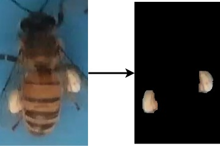
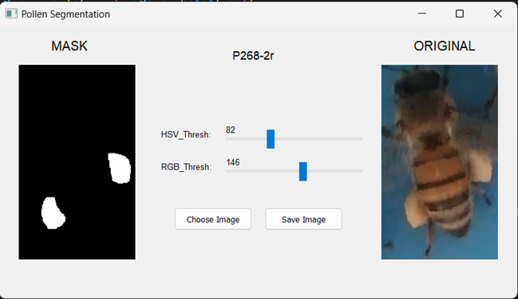

# Pollen-Segmentation
 Pollen Segmentation using Image Based Processing
## Overview
Using simple image processing algorithms, API provided by OpenCV for automatic partitioning of pollen.

Here is an example result using the method.

 

## Description
* Pollen partitioning method based on two thresholds of HSV V channel and R channel of RGB.
* Combined with OpenCV's opening and closing algorithm.
* Finally, use findContour to find the regions from which to create an algorithm that removes the bee abdomen.

## Installation
```
$ git clone git@github.com:KhoiNghiem/Pollen-Segmentation.git
$ cd Pollen-Segmentation
$ pip install -r requirements.txt
```

## Data
For pollen-carrying bee data, contact me via: khoinghiembka@gmail.com

## Usage
Using a simple GUI created by PyQT5 makes it easy to observe image changes
```
$ python GUI.py
```
 

* Choose Image
* Choose the right threshold
* Save Image
  
To evaluate the model using **Precision**, **Recall** and **AP** with the input of mask predict and ground true
```
# Change your ground_truth_folder and mask_predict_folder folders
python evaluate.py
```
